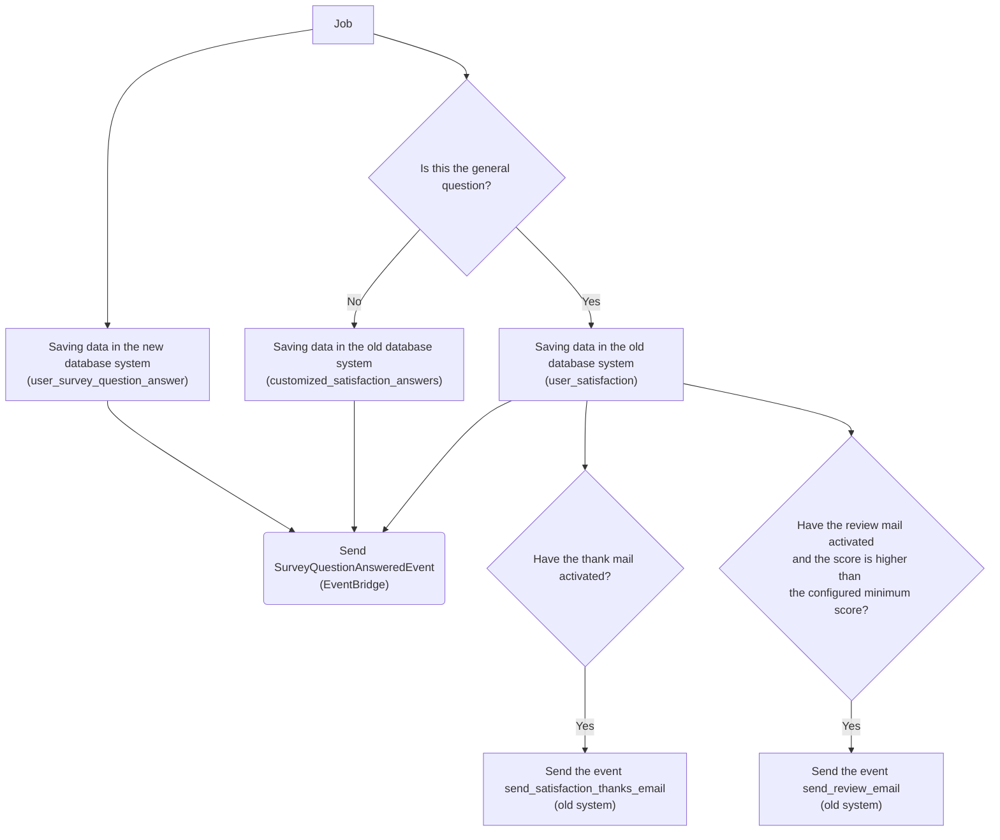
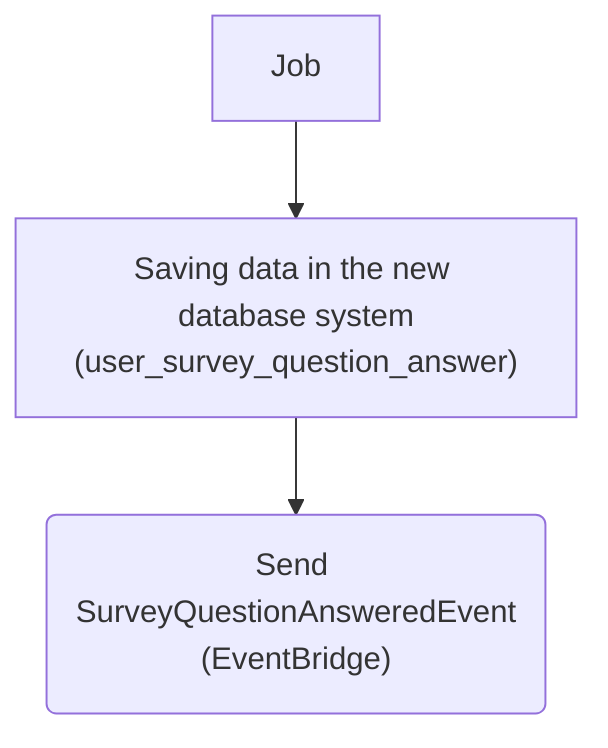

# ProcessSaveSurveyAnswer

When a question is answered from the Surveys front end a normal request will be made to our Api, which will validate the request data and if everything is correct it will queue this job.

This job will be in charge of storing the data of the answers to the questions, as well as triggering other events to perform extra tasks (such as sending a warning, review or thank you email).

When we receive an event, first of all we save it in the new database design (in which all the questions coexist, without discriminating whether it is the general or customized question). It is then also stored in the old system (the user_satisfaction table for the general question and the customized_satisfaction_answers table for a customized question). At the moment it is stored like this because there are old functionalities that depend on these tables, and due to development time the data is duplicated for the moment. Ideally, in the future, it will only be stored in the new system.

If it is a general question, we will send events in the old event system (Kinesis, SNS) so that the corresponding mails are sent. Ideally, in the future, these 2 events should be removed and the email platform would be responsible for sending them with the SurveyQuestionAnsweredEvent event, which uses the new event system with EventBridge.

As can be seen, in the future the process will be greatly simplified, reducing this flow to just this:

