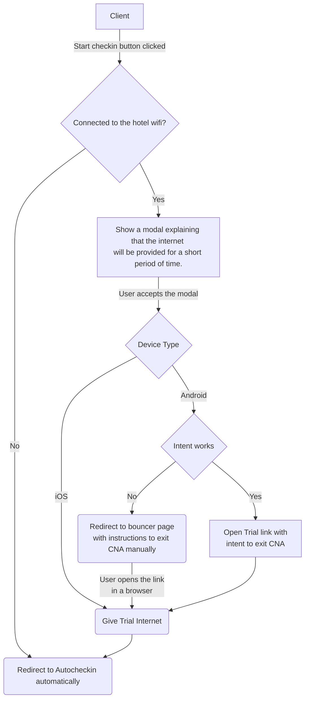

# Bouncer

The bouncer is the page that is shown to customers when they connect to the hotel Wifi. It will act as a bridge so that the client can access all the Hotelinking services, for the moment the **Autocheckin and the Captive Portal**.

## Requirements

The only thing you need to access the bouncer is that there is a hotel on your platform. After that you only need to access the url of the bouncer depending on the environment:

```sh
https://local-api.hotelinking.com/{brand_id}
https://dev-bouncer.hotelinking.com/{brand_id}
https://bouncer.hotelinking.com/{brand_id}
```

⚠️ The bouncer page will work correctly, but please note that right now the operations department only installs it if the hotel has Mikrotik, as only the Trial has been tested with this wifi integration.

## General operation

When the user lands in the Bouncer and is staying at the hotel, he has 2 options: start the online check-in process or connect to the wifi. If we detect that the client is not in the hotel network, only the check-in process is allowed.

### Connect to wifi

In this case, the only thing that is done is to open the captive portal process that we have, in which the user will have to give his or her data in order to have an internet connection.

### Check-in process

When you want to check in, things get a bit complicated, as the Bouncer usually opens with the CNA, which is a browser with very few resources and we need to exit it so that it can do the whole process (have access to the camera to scan documents, for example).



We have several ways to remove the user from the CNA depending on the type of device:

- **Android with intent**: The Trial link given will be opened via <a href="https://developer.android.com/guide/components/intents-filters?hl=es-419" target="_blank">Intent</a>. This will give you internet and redirect you to the autocheckin page in your default browser.
- **Android without intent**: We will give the user instructions on how to exit the CNA. To do so, it will be explained to them to copy the link that will be shown to them with a simple click, open their preferred browser and paste the link there. When the user opens this link in a normal browser, it will automatically request the mikrotik to get the Trial and redirect him to the Autocheckin.
- **iOs**: When the Trial is given to an iOs device, the following link is given the option to open in Safari. This gives access to the Trial and automatically clicks the button that redirects to the Autocheckin via javascript, so you will be taken out of the CNA automatically.

To find out if the intent works on a particular Android device, we open an iframe with the intent when the user accepts the modal. If it works correctly, the user will be taken out of the CNA automatically, while if it doesn't work, the user will be redirected to the redirect page of the checkin, where the steps to exit the CNA manually will appear.

## Styles

The bouncer has Tailwind installed to apply the styles to the page, as it has to look as much like Autocheckin as possible. If you are going to use a tailwind class that is not used right now, you must generate the css file again (as it excludes all unused css classes to improve efficiency) using the following command:

```sh
npm run prod
```